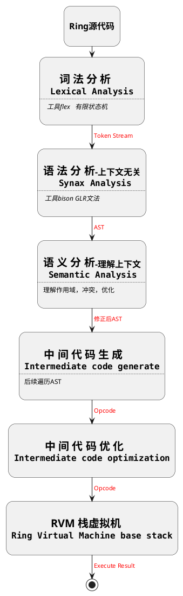

# ```Ring``` 开发思想与大方向规划


## ```Ring``` 编译器 编译流程




-------------------

# ```Ring```设计规范 

## 1. 简洁

例：

类中方法的定义逻辑上有两种形式：

函数的定义必须这样写
```ring
function set(var int age, var int score);
```

这样的函数的定义是非法的：
```ring
function set(int, int);
```


函数的实现：
```ring

function set(var int age, var int score) {
    return;
}
```

1：

```ring

typedef class Student {
    var int age;
    var int score;

    // set1 在逻辑上是可以的
    // 但是类方法多会时代码变臃肿
    // Ring 在语法层面会认为：不能在类定义中实现函数，只能定义函数。
    function set1(var int age, var int score); {
        self.age = age;
        self.score = score;
    }

    // 简洁合法
    function set2(var int age, var int score); 
};

```


