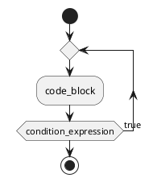

# ```Ring``` 控制语句do-while循环

## do-while条件控制语句的语法：


```ring
do{
  code_block;
}while(condition_expression);
```

- ```do``` ```while``` 为关键字 📌


## do-while循环执行流程图：




测例：
```ring

var int int_value1;
var int int_value2;

int_value1 = 0;
int_value2 = 10;

do{
	print("int_value1=", int_value1, ", int_value2=", int_value2, "\n");
	int_value1 = int_value1+1;
	int_value2 = int_value2-1;
}while(false);


```

