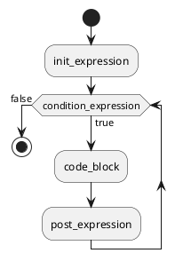
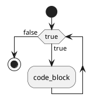

# ```Ring``` 控制语句for

## for条件控制语句的语法：


```ring
for(init_expression; condition_expression; post_expression) {
    code_block;
}
```

- ```for``` 为关键字 📌
- 最先```init_expression```执行初始化步骤。可以定义一种类型，可初始化一个或多个循环控制变量，也可以是空语句。
- 如果 ```condition_expression``` 为```true```，则执行 ```code_block``` 中的语句；否则，循环则终止。
-  执行一次循环后，执行```post_expression```更新循环控制变量。
- ```condition_expression```再次检测布尔表达式。循环执行上面的过程。


do-for 类似与 C语言，do-while，但是为了扩展 do-for，所以设计成如下：


```
do(init_expression){
	block_list;
}for(condition_expression; post_expression);

```


## for循环执行流程图：




测例：
```ring
var int int_value = 0;

for(int_value=1; int_value<10; int_value = int_value+1) {
    print(int_value, "\n");
}

```


如果 ```init_expression```、```condition_expression```、```post_expression``` 都是空的话，就相当与死循环，相当于 ```while(true)``` ：


