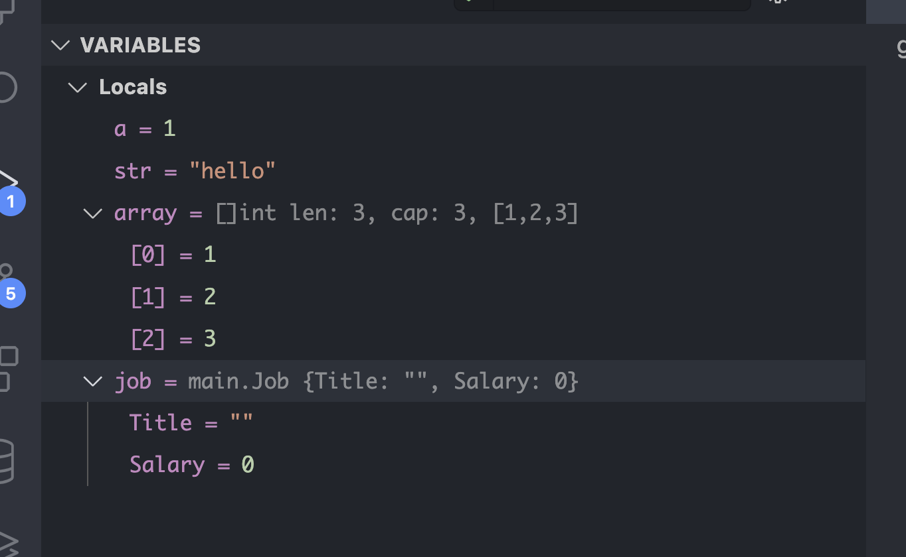
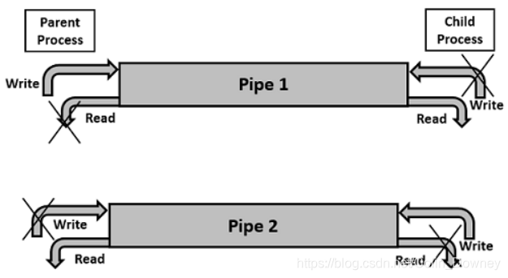
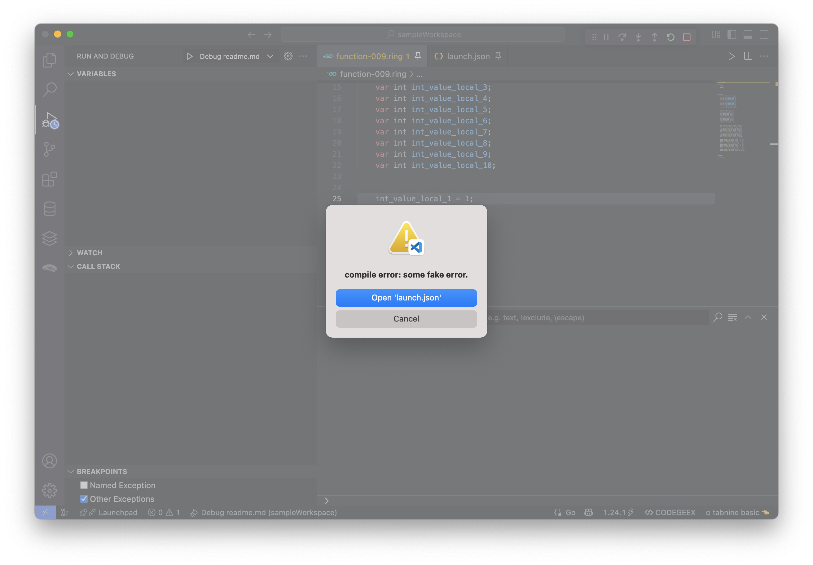
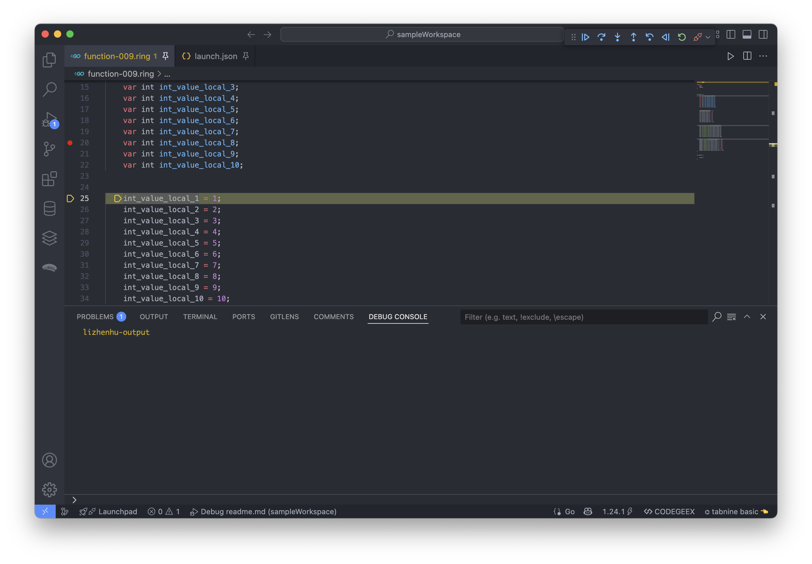
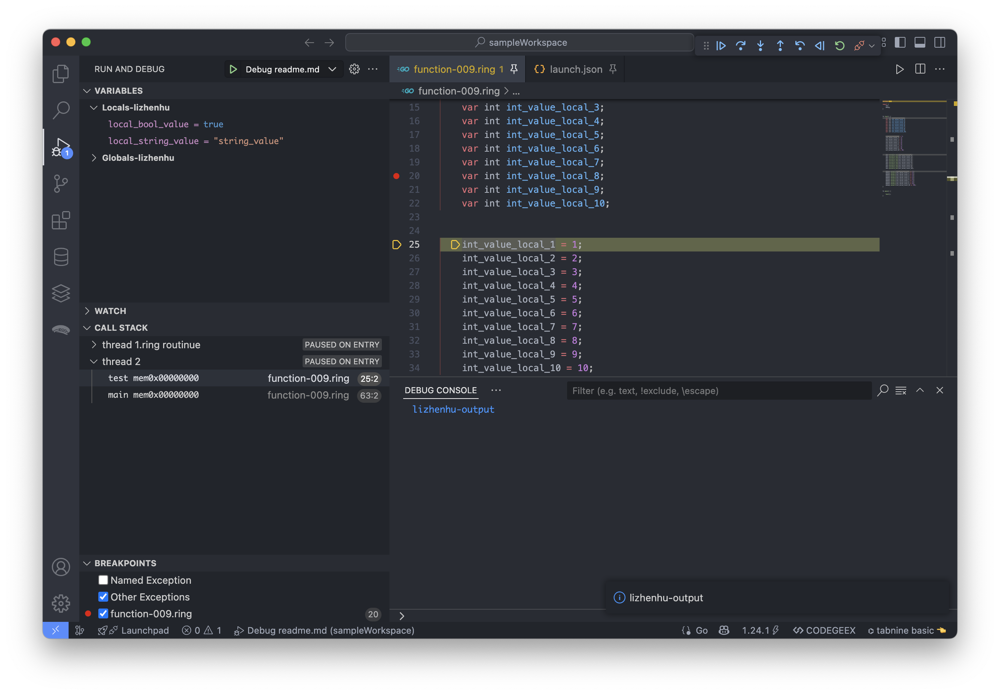

# vscode 实现一个调试器插件

关于vscode 的 debugger插件
https://code.visualstudio.com/api/extension-guides/debugger-extension

dlv lldb gdb 调试器


dap 协议常用的封装
CPP  https://github.com/google/cppdap


## 1. 更直观的了解一下 dap 协议是如何交互的

### Golang  
https://github.com/google/go-dap

这下边 有个 cmd/mockserver 可以参考一下

### 协议

dap 协议
https://microsoft.github.io/debug-adapter-protocol/overview

dap 协议报文格式细节
https://microsoft.github.io/debug-adapter-protocol/specification

dap-adapter 和 debugger 流程 交互细节
https://microsoft.github.io/debug-adapter-protocol/overview#How_it_works


## 2. 直观的了解一下，一个 lua 的 debugger 是如何实现的

一个基于 dap 实现的 vscode lua debugger 插件
https://github.com/sssooonnnggg/luau-debugger


一些 debugger 的实现
https://microsoft.github.io/debug-adapter-protocol/implementors/adapters/


1. single-session or multi-session mode ?
2. single-session
   1. starts a debug adapter as a standalone process and communicates with it through stdin and stdout
   2. starts multiple debug adapters.
3. multi-session
   1. listens on a specific port for connections attempts
   2. initiates a new communication session on a specific port and disconnects at the end of the session.


这个命令会崩溃，
./bin/ring rdb ./test/008-class/class-000.ring  


完整时序示例：
https://microsoft.github.io/debug-adapter-protocol/overview

1. 客户端 → 服务器: initialize 请求
2. 服务器 → 客户端: initialize 响应
3. 客户端 → 服务器: launch 请求
4. 服务器 → 客户端: initialized 事件
5. 客户端 → 服务器: configurationDone 请求
6. 服务器 → 客户端: process 事件（可选）
7. 服务器 → 客户端: thread 事件
8. 服务器 → 客户端: stopped 事件（在第一个断点处）

客户端在收到 stopped 事件后，通常会：
- 请求线程列表 (threads 请求)
- 请求堆栈跟踪 (stackTrace 请求)
- 请求变量 (variables 请求)
- scopes 请求

### thread 事件：
1. 通知客户端线程的创建或终止
2. 在调试会话期间维护线程列表的同步
3. 在多线程调试场景下跟踪线程生命周期

```
{
  "event": "thread",
  "body": {
    "reason": "started" | "exited",
    "threadId": number
  }
}
```

典型使用场景
- 程序启动时：调试器会为每个现有线程发送 thread 事件
- 线程创建时：当程序创建新线程时发送
- 线程结束时：当线程完成执行时发送
- 在响应 threads 请求之前：有些调试器会先发送所有线程事件

与 threads 请求的关系
- thread 事件是异步通知，而 threads 是客户端主动发起的同步请求
- 客户端通常会在收到 stopped 事件后发送 threads 请求获取完整线程列表
- 调试器可以通过 thread 事件保持客户端的线程列表更新


threads 请求（Request）
- 客户端向调试器（Debug Adapter）请求当前调试会话中的所有线程信息。
```
{
  "command": "threads",
  "type": "request",
  "seq": 4  // 序列号
}
```

```
{
  "type": "response",
  "seq": 4,
  "request_seq": 4,
  "success": true,
  "command": "threads",
  "body": {
    "threads": [
      {
        "id": 1,
        "name": "Main Thread"
      },
      {
        "id": 2,
        "name": "Worker Thread #1"
      }
    ]
  }
}
```

### seq序号 的规则

1. 客户端和调试器各自维护独立的 seq 计数器
   - 客户端发送请求时用自己的 seq（如 "seq": 4）。
   - 调试器发送响应时用自己的 seq（如 "seq": 56），但必须通过 request_seq 指明响应对应的请求。

2. 严格递增：每次发送新消息时，seq 必须比前一条消息的 seq 大 1。

3. 事件也有 seq：调试器发送的事件（如 stopped）也带 seq，但客户端不需要回应。

----------------

将调试器作为独立进程（调试器进程）与虚拟机执行进程（目标进程）分离，通过进程间通信（IPC）协调工作，是一种 经典且安全 的调试架构设计（类似 GDB 与被调试程序的关系）。以下是具体实现方案和优势分析：

1. 架构设计

```
调试器进程（你的新命令）
  ←→ [IPC: TCP/管道/共享内存] 
  ←→ 虚拟机进程（原 while 循环执行字节码）
```

- 调试器进程：处理用户调试命令（如断点、单步），查询/修改虚拟机状态。
- 虚拟机进程：专注执行字节码，仅在收到调试指令时暂停或返回状态。

7. 注意事项
- 同步问题：确保调试命令和虚拟机执行线程安全（如避免竞态条件）。
- 超时处理：防止调试器无响应导致虚拟机死锁。
- 版本兼容性：调试器与虚拟机进程的协议版本需一致。
- 分离进程：调试器与虚拟机独立，通过 IPC 通信。
- 事件驱动：虚拟机仅在断点/命令时暂停，其余时间全速执行。
- 协议解耦：可灵活升级调试功能而不影响虚拟机核心。

```
# 启动虚拟机进程（正常执行）
./my-vm program.bytecode

# 在另一个终端启动调试器并附加
./my-vm-debugger --attach 12345  # 通过 PID 或端口附加
```

----------------

## DAP 如何与你的虚拟机交互？
- VSCode 调试 UI（如断点、变量查看、调用栈）通过 DAP 发送请求。
- 你的调试适配器（DebugAdapter）解析这些请求，并转换成你的虚拟机的调试命令。
- 你的虚拟机 执行调试操作（如暂停、单步执行），并通过 DAP 返回结果。


## DAP 核心消息类型
消息类型	用途
initialize	初始化调试会话，告诉 VSCode 调试器支持的功能（如 supportsStepBack）。
launch / attach	启动或附加到调试目标（你的虚拟机）。
setBreakpoints	设置/清除断点。
stackTrace	获取当前调用栈（用于“调用堆栈”面板）。
scopes	获取当前作用域（如全局变量、局部变量）。
variables	获取变量值（用于“变量”面板）。
continue	继续执行。
next / stepIn	单步执行（步过、步入）。
stopped	调试器暂停时通知 VSCode（如遇到断点）。


## 通过中间层（调试适配器）实现

如果你的虚拟机不支持 DAP，可以在 调试适配器（DebugAdapter）中转换协议：

VSCode (DAP) <--JSON-RPC--> DebugAdapter <--自定义协议--> 你的虚拟机

调试适配器 负责：
- 接收 DAP 请求（如 setBreakpoints）。
- 转换成你的虚拟机的调试命令（如 break line:10）。
- 返回 DAP 格式的响应。


## 调试流程示例

- 用户按 F5 → VSCode 发送 launch 请求。
- 调试适配器启动虚拟机 → 返回 initialized 事件。
- 用户设置断点 → VSCode 发送 setBreakpoints。
- 虚拟机遇到断点 → 发送 stopped 事件。
- 用户查看变量 → VSCode 发送 variables 请求。
- 虚拟机返回变量值 → 显示在调试面板。


## 通过调试适配器（Debug Adapter）将你的命令行调试接口桥接到 VSCode 的 DAP 协议

VSCode (DAP/JSON-RPC) ←→ Debug Adapter (Node.js/TypeScript) ←→ 你的虚拟机 (命令行/TCP/IP/Stdio)


## 

虚拟机支持 TCP/IP 或管道通信，可以直接让调试适配器与它交互，而不是通过 CLI。这样可以更稳定地捕获调试输出。


-------

## gdb --interpreter=mi2 相关的命令

Starting Execution
1. -exec-run - Start program execution from the beginning
2. -exec-continue - Continue program execution
3. -exec-next - Execute next line (step over)
4. -exec-step - Execute next instruction (step into)
5. -exec-finish - Finish current function

Breakpoints
1. -break-insert <location> - Set a breakpoint
2. -break-delete <number> - Delete a breakpoint
3. -break-list - List all breakpoints


Asynchronous Notifications
MI2 provides asynchronous notifications about program state:
1. *stopped - When program stops (breakpoint, signal, etc.)
2. =thread-created - When a new thread is created
3. =breakpoint-modified - When a breakpoint changes


数据格式：
MI2 使用行文本协议，每条记录以换行符结束。
响应是结构化的，便于解析（如 key=value 或 {...} 的嵌套格式）。


总结
类型	前缀	说明	示例
命令	-	前端发送的命令	-exec-continue
同步响应	^	命令执行结果	^done, ^error
异步事件	*	程序状态变化	*stopped（断点命中）
状态通知	=	调试环境变化	=thread-created
控制台输出	~	GDB 打印的信息	~"Hello\n"
程序输出	@	被调试程序的输出	@'output from program\n'


------------------

## dap 中 variablesReference 是什么

用于标识和管理调试过程中的变量信息。

variablesReference 是一个整数值，用于唯一标识一组变量或一个复杂变量（如对象、数组等）。它主要有两种用途：
1. 表示变量作用域 - 在栈帧(stack frame)中标识局部变量、全局变量等作用域
2. 表示复杂变量 - 对于对象、数组等复杂数据结构，通过它可以获取其成员/元素


使用场景
1. 在栈帧响应中
当请求 stackTrace 获取调用栈时，每个栈帧可能有多个作用域的变量：

```json
{
  "scopes": [
    {
      "name": "Local",
      "variablesReference": 1001,
      "expensive": false
    },
    {
      "name": "Global",
      "variablesReference": 1002,
      "expensive": true
    }
  ]
}
```
这里的 variablesReference 用于后续获取该作用域下的变量。

2. 在变量响应中
当获取变量值时，复杂变量会有 variablesReference：

```json
{
  "name": "user",
  "type": "Object",
  "value": "Object",
  "variablesReference": 1003,
  "namedVariables": 3,  // 可选 - 命名属性数量
  "indexedVariables": 0 // 可选 - 索引元素数量(用于数组)
}
```


### 工作原理

客户端首先通过 scopes 请求获取作用域的 variablesReference
然后使用 variables 请求和该引用获取变量列表
如果变量是复杂类型，会得到新的 variablesReference，可以继续展开


- 0：表示该变量没有可展开的内容（基本类型或无法获取子项）
- 正整数：有效的引用，可用于后续请求

### 流程

- 获取调用栈 → 得到栈帧ID
- 获取作用域 → 得到作用域的 variablesReference
- 获取变量 → 可能得到复杂变量的 variablesReference
- 可以继续展开复杂变量

这种引用机制允许客户端按需懒加载变量信息，优化调试性能。


### 例子：

1. 获取作用域（Scopes）

```json
// 请求
{ "command": "scopes", "arguments": { "frameId": 1 } }

// 响应示例
{
  "scopes": [
    { "name": "Local", "variablesReference": 1001 },
    { "name": "Global", "variablesReference": 1002 }
  ]
}
```
客户端保存 1001 和 1002，用于后续查询变量。


2. 获取变量（Variables）

```json
// 请求：查询 variablesReference=1001 的变量（Local 作用域）
{ "command": "variables", "arguments": { "variablesReference": 1001 } }

// 响应示例
{
  "variables": [
    { "name": "x", "value": "42", "variablesReference": 0 },          // 基本类型
    { "name": "obj", "value": "Object", "variablesReference": 1003 }  // 可展开对象
  ]
}
```
如果 variablesReference != 0（如 1003），客户端可以继续展开该变量。

-----------------


## 在 DAP 协议中控制变量展示为 Class/Array 类型





1. 通过 variables 响应的字段控制

```json
{
  "variables": [
    {
      "name": "myArray",
      "value": "Array[3]",
      "type": "int[]",  // 明确指定类型
      "variablesReference": 1001,
      "indexedVariables": 3,  // 表示这是数组，有3个元素
      "namedVariables": 0     // 表示没有命名属性
    },
    {
      "name": "myClass",
      "value": "MyClass",
      "type": "MyClass",     // 明确指定类型
      "variablesReference": 1002,
      "namedVariables": 2,   // 表示有2个成员变量
      "indexedVariables": 0  // 表示不是数组
    }
  ]
}
```


2. 关键字段说明

控制数组展示:
- indexedVariables: 表示数组元素数量
- 当此值 > 0 时，调试客户端应将其视为数组
- 通常与 type 字段中的 Type[] 字样配合使用
- value 可以显示为 "Array[3]"

控制类/对象展示:
- namedVariables: 表示成员变量/属性数量
- 当此值 > 0 时，调试客户端应将其视为对象/类实例
- 通常与 type 字段中的类名配合使用
- value 可以显示为 "ClassName{field1=value1, ...}"


类型提示字段
- type: 明确指定变量类型（如 "MyClass"、"int[]"）
- value: 可以包含类型信息（如 "Array[3]"、"MyClass {...}"）


1. 格式化控制
可以通过 format 参数控制变量展示细节：

```json
{
  "command": "variables",
  "arguments": {
    "variablesReference": 1001,
    "format": {
      "hex": false,      // 是否显示十六进制值
      "showType": true,  // 是否显示类型
      "showStructure": true  // 是否显示结构信息
    }
  }
}
```

-----------------


sendEvent 是用于从 调试适配器（Debug Adapter）向 VSCode 调试器前端（Debugger UI）发送消息的方法。这些消息通常是调试过程中发生的事件，例如：

1. 程序停止（StoppedEvent）
2. 断点命中（BreakpointEvent）
3. 输出信息（OutputEvent）
4. 线程创建/销毁（ThreadEvent）
5. 调试会话结束（TerminatedEvent


--------------

## vscode 的 debug 过程中，是如何实现鼠标悬浮在变量名称上，能够展示变量值

流程概述
当用户在调试过程中 鼠标悬停在变量上 时：
1. VSCode 前端 检测到悬停事件，并发送 evaluateRequest 给调试适配器（Debug Adapter）。
2. 调试适配器 查询当前作用域的变量值（如通过 GDB 的 -var-evaluate-expression 命令）。
3. 调试适配器 返回变量值，VSCode 以 Tooltip 形式显示。

req:

```
{
    "command": "evaluate",
    "arguments": {
        "expression": "variableName", // 变量名
        "frameId": 1,                // 当前栈帧
        "context": "hover"           // 表示是悬停触发的查询
    }
}
```

resp:
```
{
    "body": {
        "result": "42",       // 变量值
        "variablesReference": 0  // 0 表示简单类型（无子属性）
    }
}
```


var-evaluate-expression 命令
-var-evaluate-expression [options] name 

name：要计算的变量名（必须是通过 -var-create 创建的变量对象）。
options（可选）：
    --thread ID：指定线程（多线程调试时使用）。
    --frame ID：指定栈帧（通过 -stack-list-frames 获取的帧 ID）。


--------------

## 对于虚拟机式的编程语言，如何实现 数据断点

拟机语言的数据断点通常通过以下方式实现：
1. 变量访问事件钩子：利用虚拟机的调试接口注册变量访问回调
2. 对象属性拦截：对于动态语言，使用代理(Proxy)机制拦截属性访问
3. 字节码插桩：在字节码层面插入检查指令

--------------


## 调试器中repl

轻量级解析器（推荐），为调试器单独实现一个 仅支持表达式的子集语法（避免复杂语句如 if/for）：

表达式语法示例：
```
   expr ::= term (+|-|*|/ term)*
   term ::= identifier | number | identifier.member | (expr)
```

优势：
代码量小（约 500 行 C++）。
直接对接字节码 VM，无需依赖第三方库。

示例实现：
```
Value eval(const std::string& expr) {
    ASTNode* ast = parseExpression(expr);  // 自定义轻量级解析
    BytecodeChunk chunk = compileToBytecode(ast);  // 生成临时字节码
    return vm.execute(chunk);  // 在隔离的调试上下文中执行
}
```

--------------


1. 编写一个简单的golang 程序，调用gdb，看看是如何交互的

gdb mi协议 https://www.sourceware.org/gdb/current/onlinedocs/gdb.html/GDB_002fMI.html#GDB_002fMI

https://ftp.gnu.org/old-gnu/Manuals/gdb/html_chapter/gdb_22.html

建议不要深入了解mi协议，直接使用dap

2. 调用 delve 调试器，看看是如何交互的，如何实现的


--------


DAP 协议本身与传输层解耦，但主流实现使用 TCP/IP 或 stdio。

TCP/IP 是推荐方式（尤其需要远程调试时）。

Go 实现建议：使用 net.Listen 或 jsonrpc2 库（如 go-dap）。


1. DAP 的通信方式
DAP 协议本身是 语言和传输层无关的，但实际实现中主要采用以下两种方式：

传输方式	描述	典型场景
TCP/IP	调试器（Debug Adapter）作为服务端，监听本地端口（如 localhost:4711），IDE 通过 TCP 连接。	多数生产级调试器（如 VS Code 默认）
标准输入/输出（stdio）	调试器与 IDE 通过进程的 stdin/stdout 交换 JSON-RPC 消息。	轻量级集成或子进程调试器


2. TCP/IP 的典型工作流程（以 VS Code 为例）
   
步骤 1：调试器启动 TCP 服务
调试器（Debug Adapter）启动后监听本地端口（例如 4711）：

```go
// Go 示例：启动 DAP 的 TCP 服务
listener, err := net.Listen("tcp", "localhost:4711")
if err != nil {
    log.Fatal(err)
}
defer listener.Close()
```

步骤 2：IDE 连接调试器
VS Code 的 launch.json 配置中指定端口：

```json
{
    "version": "0.2.0",
    "configurations": [
        {
            "name": "Attach to Debugger",
            "type": "your-debugger-type",
            "request": "attach",
            "port": 4711  // 指定 TCP 端口
        }
    ]
}
```


步骤 3：交换 JSON-RPC 消息
IDE 发送请求（如设置断点）：

```json
{
    "command": "setBreakpoints",
    "arguments": {"source": {"path": "/path/to/file"}, "breakpoints": [{"line": 5}]},
    "seq": 1
}
```
调试器返回响应：

```json
{
    "seq": 1,
    "type": "response",
    "command": "setBreakpoints",
    "success": true,
    "body": {"breakpoints": [{"verified": true, "line": 5}]}
}
```


1. stdio 的典型工作流程
步骤 1：IDE 启动调试器子进程
VS Code 的 launch.json 配置为使用 stdio：

```json
{
    "type": "your-debugger-type",
    "request": "launch",
    "program": "${file}",
    "console": "internalConsole",
    "debugServer": "your-debugger-executable"  // 调试器二进制路径
}
```

步骤 2：通过 stdin/stdout 通信
调试器从 stdin 读取请求，向 stdout 写入响应：

```go
// Go 示例：处理 stdio 的 DAP 请求
decoder := json.NewDecoder(os.Stdin)
encoder := json.NewEncoder(os.Stdout)

for {
    var request dap.Request
    if err := decoder.Decode(&request); err != nil {
        log.Fatal(err)
    }
    // 处理请求并返回响应
    encoder.Encode(response)
}
```


----------------


## 当 DAP（Debug Adapter Protocol）使用 stdio（标准输入/输出）作为通信方式时，IDE（如 VS Code）会主动拉起调试器进程（Debug Adapter），并通过管道（pipe）建立双向通信


### 步骤 1：IDE 启动调试器进程

IDE（如 VS Code）通过配置（如 launch.json）指定调试器的可执行文件路径。
IDE 作为父进程，使用子进程的方式启动调试器（Debug Adapter），并自动创建 三个管道：
stdin：IDE → 调试器（发送请求）。
stdout：调试器 → IDE（返回响应）。
stderr：调试器 → IDE（输出错误日志）。

### 步骤 2：建立 JSON-RPC 通信

调试器 从 stdin 读取 JSON-RPC 请求（如设置断点、启动程序）。
调试器 将响应或事件（如断点命中、程序输出）写入 stdout。
IDE 监听 stdout 并解析响应。

###  步骤 3：交互直至调试结束

整个过程持续到调试会话终止（如用户点击“停止”或程序退出）。
IDE 最终会终止调试器子进程。


###  与 TCP/IP 模式的对比
特性	stdio 模式	TCP/IP 模式
通信方式	管道（进程间通信）	网络套接字（本地或远程）
启动方式	IDE 直接拉起调试器子进程	调试器作为独立服务监听端口
性能	更高（无网络序列化开销）	略低（需经过协议栈）
适用场景	本地集成调试	远程调试或多 IDE 共享调试器
配置复杂度	简单（只需指定二进制路径）	需处理端口、防火墙等


----------------

## c语言 在 fork进程的时候，是如何绑定 stdin stdout stderr 作为管道的

1. 创建管道：使用 pipe() 系统调用创建管道（返回两个文件描述符，pipefd[0] 读端，pipefd[1] 写端）。
2. 调用 fork()：创建子进程。
3. 重定向文件描述符：在子进程中，用 dup2() 将管道的读写端绑定到标准输入/输出。
4. 关闭未使用的文件描述符：避免资源泄漏。


https://blog.csdn.net/Colin_Downey/article/details/90179609



```cpp
#include <stdio.h>
#include <unistd.h>
#include <sys/wait.h>

int main() {
    int pipe_parent_to_child[2];  // 父进程写 → 子进程读
    int pipe_child_to_parent[2];  // 子进程写 → 父进程读
    pid_t pid;

    // 1. 创建管道
    if (pipe(pipe_parent_to_child) == -1 || pipe(pipe_child_to_parent) == -1) {
        perror("pipe");
        return 1;
    }

    // 2. 创建子进程
    pid = fork();
    if (pid == -1) {
        perror("fork");
        return 1;
    }

    if (pid == 0) {  // 子进程
        close(pipe_parent_to_child[1]);  // 关闭父进程的写端
        close(pipe_child_to_parent[0]);  // 关闭父进程的读端

        // 3. 重定向 stdin/stdout
        dup2(pipe_parent_to_child[0], STDIN_FILENO);   // 子进程的 stdin 来自管道读端
        dup2(pipe_child_to_parent[1], STDOUT_FILENO);  // 子进程的 stdout 写入管道写端
        dup2(pipe_child_to_parent[1], STDERR_FILENO);  // stderr 同样重定向（可选）

        // 4. 关闭多余描述符
        close(pipe_parent_to_child[0]);
        close(pipe_child_to_parent[1]);

        // 子进程执行命令（示例：用 `cat` 回显输入）
        execlp("cat", "cat", NULL);  // 如果 execlp 失败：
        perror("execlp");
        _exit(1);
    } else {  // 父进程
        close(pipe_parent_to_child[0]);  // 关闭子进程的读端
        close(pipe_child_to_parent[1]);  // 关闭子进程的写端

        // 5. 父进程向子进程发送数据
        const char* message = "Hello from parent!\n";
        write(pipe_parent_to_child[1], message, strlen(message));
        close(pipe_parent_to_child[1]);  // 关闭写端（发送 EOF）

        // 6. 读取子进程的返回结果
        char buffer[1024];
        ssize_t count = read(pipe_child_to_parent[0], buffer, sizeof(buffer));
        if (count > 0) {
            write(STDOUT_FILENO, "Child replied: ", 15);
            write(STDOUT_FILENO, buffer, count);
        }

        close(pipe_child_to_parent[0]);
        wait(NULL);  // 等待子进程退出
    }

    return 0;
}
```

流程:
```
父进程                             子进程
───────────────────────────────────────────────────
pipe_parent_to_child[1] → 写入 → pipe_parent_to_child[0] (stdin)
pipe_child_to_parent[1] ← 读取 ← pipe_child_to_parent[0] (stdout/stderr)
```

----------------


## configurationDone


主要功能
1. 通知调试器客户端已完成配置：告诉调试适配器(debug adapter)客户端已经发送完所有初始配置请求(如设置断点、设置异常处理等)
2. 启动调试会话：在某些调试器中，只有收到configurationDone请求后，调试器才会真正开始执行被调试程序
3. 同步点：确保所有初始配置在程序开始运行前都已正确应用


典型使用场景

1. 客户端(如VS Code)在启动调试会话后：

- 首先发送initialize请求
- 然后发送launch或attach请求
- 接着设置断点和其他配置
- 最后发送configurationDone表示配置完成

2. 对于需要用户交互启动的调试会话(如按F5)，VS Code会在用户按下启动按钮后发送此请求


注意事项
1. 不是所有调试适配器都严格要求这个请求，但按照协议规范应该发送
2. 在某些调试器中，如果不发送此请求，程序可能不会开始执行
3. 这个请求没有参数，也不需要响应体


----------------


## breakpointLocationsRequest


主要用于获取源代码中适合设置断点的有效位置。它的核心功能是帮助调试客户端确定在指定范围内可以设置断点的所有可能位置。

### 主要用途

1. 断点位置预览：

当用户在IDE中悬停或准备设置断点时，可以提前显示所有可设置断点的位置

常见于显示代码行号旁边的断点槽(gutter)中的断点标记

2. 验证断点位置：

确保客户端不会在无效位置(如空白行或注释行)设置断点

3. 支持语言特性：

对于一行多语句的语言(如JavaScript)，识别一行中多个可断点位置


```ts
let a = 1; let b = 2; // 这一行有两个可断点位置


请求参数
```ts
interface BreakpointLocationsArguments {
  source: Source;          // 源文件信息
  line: number;            // 起始行号
  endLine?: number;        // 可选结束行号(用于范围查询)
  endColumn?: number;      // 可选结束列号
  column?: number;         // 可选起始列号
}
```

响应格式
```ts
interface BreakpointLocationsResponse extends Response {
  body: {
    breakpoints: BreakpointLocation[]; // 可设置断点的位置数组
  };
}


interface BreakpointLocation {
  line: number;      // 行号(1-based)
  column?: number;   // 可选列号(1-based)
  endLine?: number;  // 可选结束行号
  endColumn?: number;// 可选结束列号
}

```


典型使用场景

1. IDE断点可视化：

VS Code等编辑器在打开文件时，会查询可断点位置来显示断点槽

2. 调试器兼容性：

对于不支持任意位置断点的调试器(如某些嵌入式系统调试器)，确保只显示有效位置

3. 复杂语言支持：

在Python等使用缩进的语言中，帮助确定逻辑行的有效断点位置
这个请求使得调试客户端能够提供更精确、用户友好的断点设置体验，而不是盲目地允许在任何位置设置可能无效的断点。


----------------


## sendErrorResponse

```ts
		this.sendErrorResponse(response, {
			id: 1001,
			format: `compile error: some fake error.`,
			showUser: true,
			url: "https://ring.wiki",
			urlLabel: "Ring Wiki"
		});
```





常见错误码
DAP 定义了一些标准错误码(在 DebugProtocol 命名空间中):
- ErrorCodes.ParseError (3000)
- ErrorCodes.RequestFailed (2004)
- ErrorCodes.RequestCancelled (2005)
- ErrorCodes.NotImplemented (2006)

----------------
```ts

		const ouputEvent: DebugProtocol.OutputEvent = new OutputEvent('lizhenhu-output');
		this.sendEvent(ouputEvent);
```





```ts

		const ouputEvent: DebugProtocol.OutputEvent = new OutputEvent('lizhenhu-output', 'important');
		this.sendEvent(ouputEvent);
```



----------------


## setExceptionBreakpointsRequest 是干什么的

----------------


## exceptionInfoRequest

```ts
interface ExceptionInfoArguments {
  threadId: number;  // 必需，发生异常的线程ID
}
```

```ts
interface ExceptionInfoResponse extends Response {
  body: {
    exceptionId: string;            // 异常类型标识（如"System.NullReferenceException"）
    description?: string;           // 可读的异常描述
    breakMode: 'never' | 'always' | 'unhandled' | 'userUnhandled'; // 中断模式
    details?: ExceptionDetails;     // 详细的异常信息（可选）
  };
}

interface ExceptionDetails {
  message?: string;                 // 异常消息
  typeName?: string;                // 异常类型名
  fullTypeName?: string;            // 完整类型名（含命名空间）
  stackTrace?: string;              // 堆栈跟踪信息
  innerException?: ExceptionDetails[]; // 内部异常（嵌套异常）
}
```


### 典型使用场景
1. 显示异常弹窗：
IDE在异常中断时显示详细的错误信息

2. 异常诊断：
在调试控制台输出完整的异常堆栈

3. 条件断点：
基于特定异常信息决定是否中断


### 与其他请求的协作

1. 先通过stopped事件（reason为'exception'）检测到异常暂停

2. 然后发送exceptionInfoRequest获取详情

3. 结合stackTraceRequest获取完整的调用堆栈

----------------


----------------


vscode 调试 功能
https://vscode.github.net.cn/docs/editor/debugging

运行模式


----------------


 ./bin/ring --interpreter=rdp rdb ./test/007-array/array-000.ring


- 支持函数断点