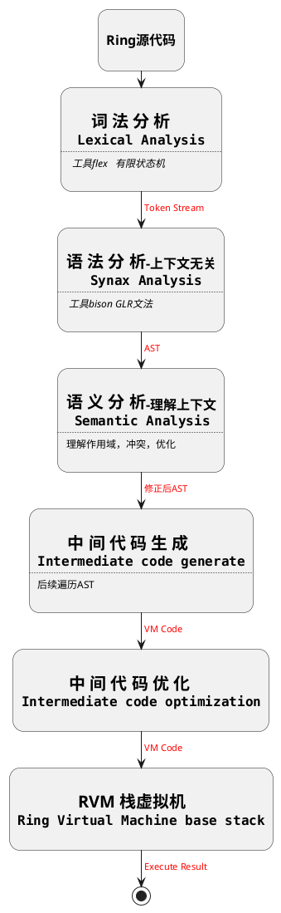

# Ring 杂想

## Ring 编译器流程图

## Why Design A New Programing Language

关于为什么要设计一个新的编程语言、写一个编译器，这大概是内心的兴趣所向，目前自己接触过这些编程语言：C/C++，Golang，Python，PHP。感觉这几种语言总是有几个痛点：

- C/C++：
  - 编译流程复杂，引用第三方库方式比较老旧
  - 内存管理较复杂
- Golang：
  - 没有比较好的错误处理方式
- Python：
  - 执行速度慢
  - 代码块使用 tab来制定
- PHP：
  - 执行速度慢
  - 代码的分发方式不太喜欢

所以自己想要写一个符合自己喜好编程语言。
- 能够集大家之所长，
- 有更鲜明的特点
- 能够结果某专业领域的特定问题
- 能够跨平台
- 有较为成熟的垃圾回收，内存管理方案
- 较好的支持协程
- 好的工程管理方法、工具
- 完善的错误处理方式
- 完善、无二义性的语法语义

## 一些不切实际的展望

- 开放语法检查api，可以让vscode等ide去调用进行语法检查。
- 编译是支持 dwarf格式文件，支持GDB调试Ring语言
- Ring 支持原生代码格式化
- Ring 支持导出原生代码函数调用关系图

-------------------

##  Ring设计规范 

### 1. 语法要简洁

### 2. 没有二义性

### 3. 继承一些成熟语言的语法糖

-------------------

## Ring名字来源

大学的时候反反复复看了四遍指环王、霍比特人系列的电影，超级喜欢中土世界，所以 Ring 取自名称 *指环王 The Lord of the Rings*。

- 至尊魔戒（*One Ring*）
- 亦即是支配魔戒（*Ruling Ring*）
- 大魔戒（*The Great Ring*，或译为统御魔戒）
- 强力魔戒（*Great Ring of Power*）
- 魔戒（*The Ring*）

> [!TIP|label:Reference The Lord of the Rings wikipedia]
> 
> https://zh.wikipedia.org/wiki/%E8%87%B3%E5%B0%8A%E9%AD%94%E6%88%92

---------------------

## Reference

> [!TIP|label:lua 官网]
> 
> https://lua.org

> [!TIP|label:Programming in Lua]
> 
> https://www.lua.org/pil/

> [!TIP|label:Lua]
> 
> Lua 4.0.1 基于栈虚拟机实现
> https://github.com/GeneralSandman/lua-4.0.1
> 
> Lua 5.4.4 基于寄存式虚拟机实现
> https://github.com/GeneralSandman/lua-5.4.4

> [!TIP|label:仿制lua解释器]
> 
> https://github.com/Manistein/dummylua-tutorial

> [!TIP|label:lua upvalue]
> 
> https://blog.csdn.net/chenjiayi_yun/article/details/25219937

> [!TIP|label:lua 垃圾回收]
> 
> https://yuerer.com/Lua5.3-%E8%AE%BE%E8%AE%A1%E5%AE%9E%E7%8E%B0(%E5%85%AD)-GC%E5%9E%83%E5%9C%BE%E5%9B%9E%E6%94%B6/

> [!TIP|label:rust]
> 
> https://kaisery.github.io/trpl-zh-cn/title-page.html

> [!TIP|label:rust cargo]
> 
> https://kaisery.github.io/trpl-zh-cn/ch01-03-hello-cargo.html

> [!TIP|label:c thread pool]
> 
> https://github.com/Pithikos/C-Thread-Pool

