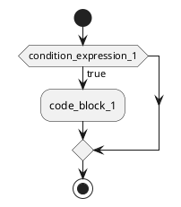
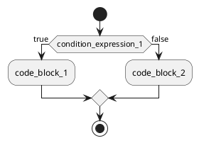
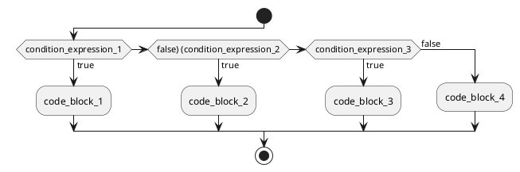

# ```Ring``` 控制语句if

## if条件控制语句的语法：

```ring
if(condition_expression_1) {
    code_block_1;
}
```

- ```if``` 为关键字 📌
- 如果 ```布尔表达式``` 为```true```，则执行 ```code_block``` 中的语句。

if条件控制执行流程图：



-----------------------

## if-else条件控制语句的语法：


```ring
if(condition_expression_1) {
    code_block_1;
} else {
    code_block_2;
}
```

else 语句可无





-----------------------

## if-elseif条件控制语句的语法：


```ring
if(condition_expression_1) {
    code_block_1;
} elseif(condition_expression_2) {
    code_block_2;
} elseif(condition_expression_3) {
    code_block_3;
} else {
    code_block_4;
}
```

else 语句可无

