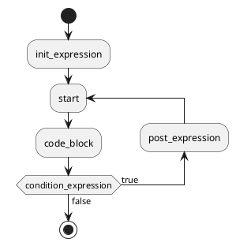

# Ring 控制语句do-for循环

## 1. do-for条件控制语句的语法


do-for 类似与 C语言，do-while，但是为了扩展 do-for，所以设计成如下：


```
do(init_expression){
	code_block;
}for(condition_expression; post_expression);

```

- ```do``` ```for``` 为关键字 📌


## 2. do-for循环执行流程图





测例：
```ring

var int int_value1;
var int int_value2;

int_value1 = 0;
int_value2 = 10;

do{
	print("int_value1=", int_value1, ", int_value2=", int_value2, "\n");
	int_value1 = int_value1+1;
	int_value2 = int_value2-1;
}for(false);


```

