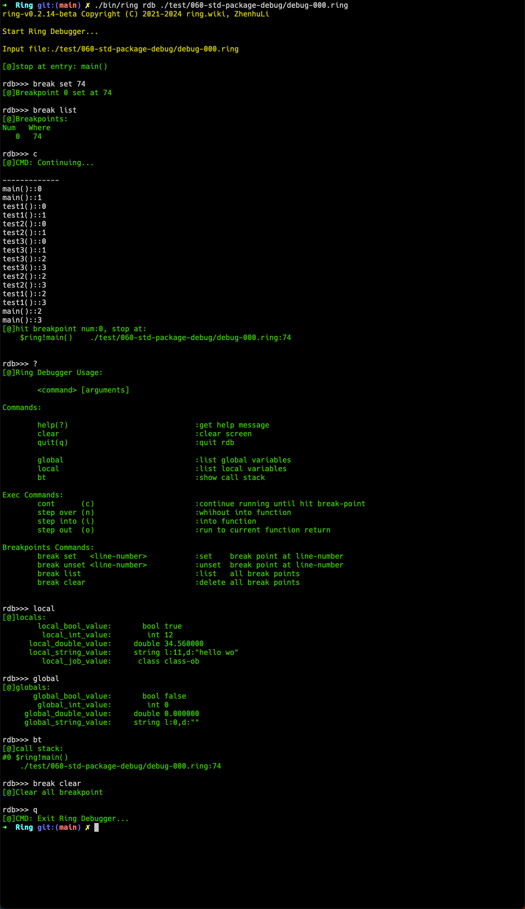

# 调试器

Ring 编译器提供了一个命令行交互式调试器。

可以通过一下命令运行调试器：

```bash
    ring rdb <input-file>

    
    ring rdb ./test/060-std-package-debug/debug-000.ring
```





## 1. 调试器的基本命令

调试器支持以下命令：


### help(?) [command]

Without argument, print the list of available commands. With a command as argument, print help about that command. 


### clear

Clear the screen.


### quit(q)

Quit from the debugger. The program being executed is aborted.


### global

Print the global variables.


### local

Print the local variables.

### bt

Print a stack trace, with the most recent frame at the top.


### cont(c)

Continue execution, only stop when a breakpoint is encountered.


### step over(n)

Continue execution until the next line in the current function is reached or it returns. 


### step into(i)


### step out(o)

Continue execution until the current function returns.


### break set <line-number>

Set a break at *line-number*.

### break unset <line-number>

Unset a break at *line-number*.

### break list

List all the breakpoints.


### break clear

Clear all the breakpoints.


## 2. 调试器中各种颜色代表什么意思

- 黄色: ring编译器信息, ring调试器信息
- 绿色: ring调试器命令行反馈
- 白色: 命令行的输入 和 调试程序的输出